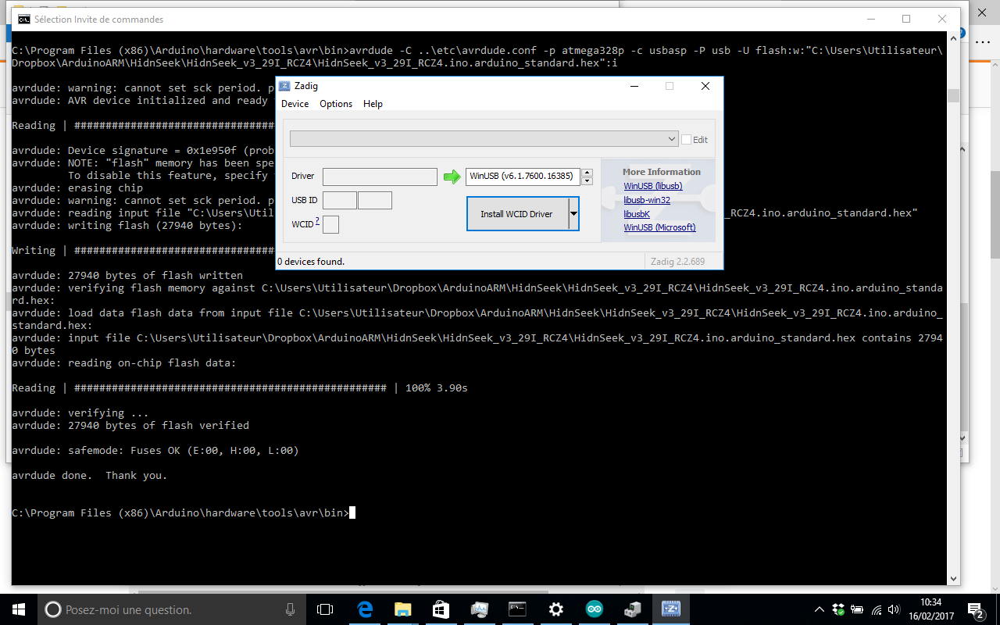

### Arduino IDE Setup

The first thing you will need to do is to download the latest release of the Arduino IDE. You will need to be using version **1.6.4** or higher for this guide.

[Arduino IDE v1.6.x](http://www.arduino.cc/en/Main/Software)

After you have downloaded and installed **v1.6.4**, you will need to start the IDE and navigate to the **Preferences** menu. You can access it from the **File** menu in Windows or Linux, or the **Arduino** menu on OS X.

A dialog will pop up and we will be adding a URL to the new **Additional Boards Manager URLs** option. The list of URLs is comma separated, and you will only have to add each URL once. New HidnSeek board and update to existing boards will automatically be picked up by the Board Manager each time it is opened. The URLs point to index files that the Board Manager uses to build the list of available & installed boards.
To find the most up to date list of URLs you can add, you can visit the list of [third party board URLs on the Arduino IDE wiki](https://github.com/arduino/Arduino/wiki/Unofficial-list-of-3rd-party-boards-support-urls#list-of-3rd-party-boards-support-urls). We will only need to add one URL to the IDE in this example, but **you can add multiple URLS by separating them with commas**. Copy and paste the link below into the **Additional Boards Manager URLs** option in the Arduino IDE preferences.

[https://hidnseek.github.io/hidnseek/package_hidnseek_boot_index.json](https://hidnseek.github.io/hidnseek/package_hidnseek_boot_index.json)

Click **OK** to save the new preference settings. Next we will look at installing boards with the Board Manager.

### Installing Boards

Now that you have added the appropriate URLs to the Arduino IDE preferences, you can open the **Boards Manager** by navigating to the **Tools->Board** menu. Find and install **USBaspLoader HidnSeek** board.

Next, **quit and reopen the Arduino IDE** to ensure that all of the boards are properly installed. You should now be able to select and upload to the new boards listed in the **Tools->Board** menu.

### USBasp Drivers for Windows
* **Windows up to 7.x** : [usbasp-windriver.2011-05-28.zip](usbasp-windriver.2011-05-28.zip)
* **Windows 8.1 to 10.x** : [USBasp-win-driver-x86-x64-v3.0.7.zip](USBasp-win-driver-x86-x64-v3.0.7.zip)

The USBASP windows driver was previously based on libusb-win32. The certificate on the base drivers have expired and the library has now been superseded by libusbK. Earlier today we packaged up the driver and uploaded it to the server. You can now download it from the location below.

 [http://www.protostack.com/download/USBasp-win-driver-x86-x64-v3.0.7.zip] (http://www.protostack.com/download/USBasp-win-driver-x86-x64-v3.0.7.zip)
 
This driver should work with version of Windows XP right through to 8.1 and the version 10 preview. (both 32 and 64 bit editions). Because the driver is signed, there should be no need to disable driver certificate enforcement or use Zadig.

### Update Febuary 16 to upgrade the firmware with hex provided on the website

first, power off the hidnSeek tracker (dance on manual page 16 or short circuit R&G pins)

* On Windows 10, install the executable version of [Arduino IDE v1.8.x](http://www.arduino.cc/en/Main/Software)
not the Windows App version.

* install the driver from Zadig [http://zadig.akeo.ie/downloads/zadig_2.2.exe] (http://zadig.akeo.ie/downloads/zadig_2.2.exe)

Launch the software, connect the tracker and click on the install button. It will detect the tracker and install correct drivers. Disconnect the tracker before Green LED start blinking, if it blink, power off again the tracker.

* Open a command windows (Win+X), go in the C:\Users\Program Files(x86)\Arduino\hardware\tools\avr\bin and prepare the command as above with a respect of the path of the hex file:

**avrdude -C ..\etc\avrdude.conf -p atmega328p -c usbasp -P usb -U flash:w:"C:\Users\[your path]\HidnSeek.hex":i**

When you are ready, connect the tracker to the USB port and launch the command. If there is an error, unplug the tracker to avoid to repeat the power off procedure.
