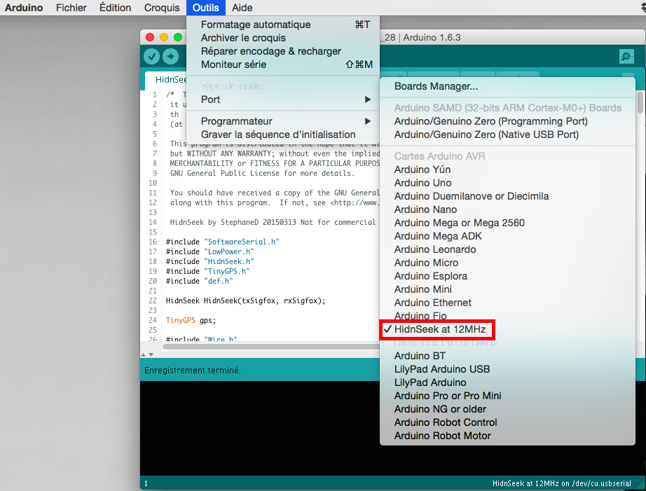
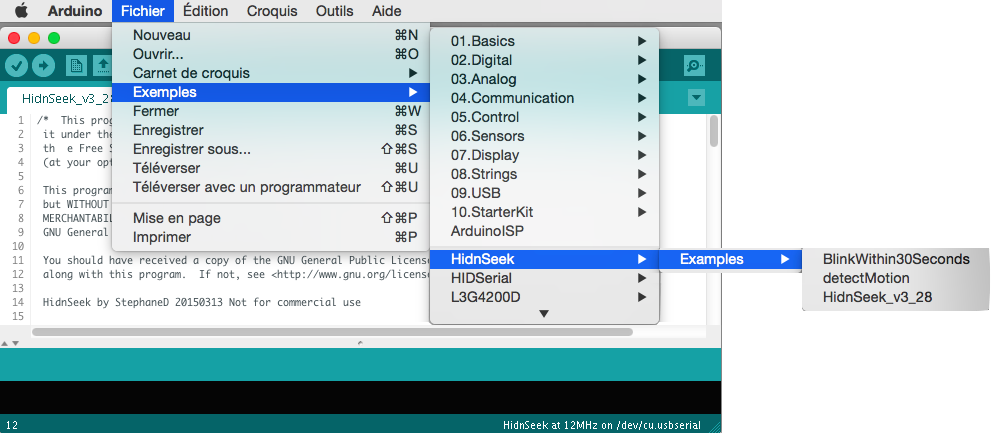

#Arduino Hardware, source code and libraries
##Hardware : changes and needs for Arduino IDE 1.6.x

How to upload new firmware in Hidnsek ?

First install Arduino IDE (https://www.arduino.cc/en/Main/Software)
If Arduino IDE already installed, leave/exit the software.

Second, find in the installation directory the boards.txt file

* /Applications/Arduino.app/Contents/Java/hardware/arduino/avr/boards.txt (Mac)
* c:\Documents and Settings\<USERNAME>\Application Data\Arduino\hardware\arduino\avr\boards.txt (Windows XP)
* c:\Users\<USERNAME>\AppData\Roaming\Arduino\hardware\arduino\avr\boards.txt (Windows Vista)
* ~/.arduino/hardware/arduino/avr/boards.txt (Linux)

Insert at the end of this file the description of HidnSeek from [boards.txt](Hardware/boards.txt) 

##libraries : librairies used to compile the sketch

Copy all libraries in this repository that are not present in your libraries directory

##HidnSeek Sketch Examples

Launch Arduino IDE and go to the board selection and select HidnSeek at 12MHz

Go to the Examples and select one of available in the HidnSeek tree (BlinkWithin30seconds, HidnSeek_v3_28 and detectMotion)

###HidnSeek_v3_28 of the 3.28 release board:
Load the sketch HidnSeek_v3_28 and compile it. The code size must be 24 950 bytes and available memory is 1027 bytes

There is two methods to prepare HidnSeek for DFU mode (firmware update)

1. make the dance that you can find on the manual or [FAQ](https://www.hidnseek.fr/faq)
2. make a short circuit between R & G pins (you will loose daily statistics)

Once it's done, you can plug the USB cable to the computer and the HidnSeek board.
You will see between 30 and 60 red LED flashes to notice that you are in DFU mode. Click on download on your sketch windows.
Firmware update will be transfered in less than 4 seconds. Do not care about the clk speed warning.
Your sketch is ready to start after the booting time (0-30) seconds

Have fun !
